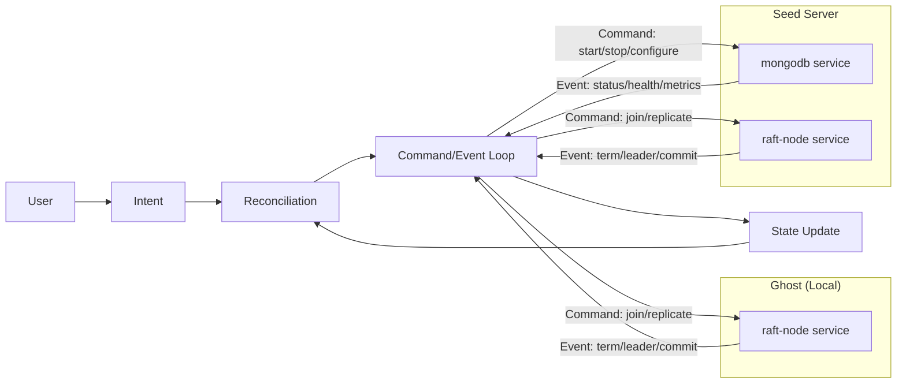

# Ghost Control Loop

Example deployment used in this flow:
- Ghost control plane runs locally with a local `raft-node` service.
- One seed server exposes `mongodb` and `raft-node` services.

```mermaid
flowchart LR
    U["User"]
    I["Intent"]
    R["Reconciliation"]
    C["Command/Event Loop"]
    S["State Update"]

    subgraph G["Ghost (Local)"]
        GR["raft-node service"]
    end

    subgraph SEED["Seed Server"]
        SM["mongodb service"]
        SR["raft-node service"]
    end

    U --> I
    I --> R
    R --> C
    C --> S
    S --> R

    C -->|"Command: start/stop/configure"| SM
    C -->|"Command: join/replicate"| SR
    C -->|"Command: join/replicate"| GR

    SM -->|"Event: status/health/metrics"| C
    SR -->|"Event: term/leader/commit"| C
    GR -->|"Event: term/leader/commit"| C
```
