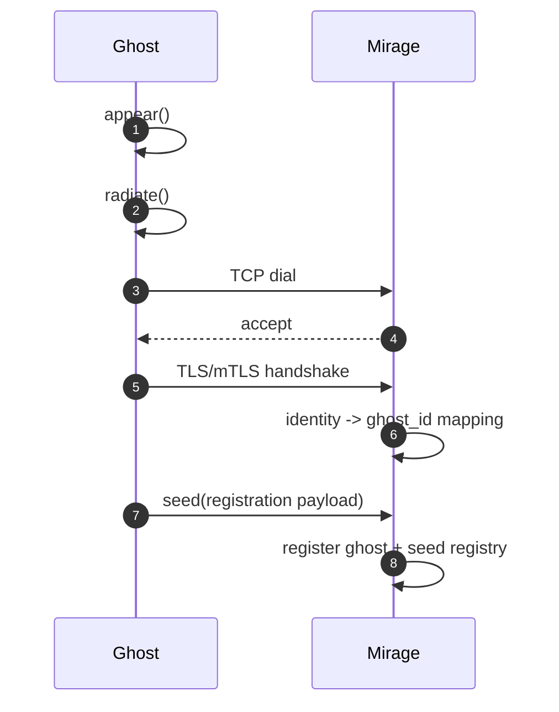

# Mirage-Ghost Transport Contract

This document defines transport-layer behavior for Mirage and Ghost control-plane links.
It builds on the architecture and protocol contracts.

## References

- Architecture contract: [`definitions/design.toml`](definitions/design.toml)
- Protocol boundary contract: [`definitions/protocol.toml`](definitions/protocol.toml)
- Canonical definitions: [`../glossary/definitions.md`](../glossary/definitions.md)
- Envelope shapes: [`../glossary/envelopes.md`](../glossary/envelopes.md)
- TLV contract: [`../glossary/tlv.md`](../glossary/tlv.md)

## Scope

- Applies only to Mirage<->Ghost control-plane communication.
- Does not define Ghost->Seed adapter transports.

## Normative Transport Requirements

- Transport MUST be `TCP`.
- Session model MUST be one long-lived stream connection per Ghost process instance.
- Connection direction MUST be outbound from Ghost to Mirage.
- `UDP` MUST NOT be used for Mirage<->Ghost command/event transport.
- `SSH` MUST NOT be used as the Mirage<->Ghost wire protocol.

## Security Baseline

- Development mode MAY allow non-TLS transport behind explicit configuration.
- Production mode MUST require TLS.
- Production mode SHOULD require mTLS and peer identity binding to `ghost_id`.
- Mirage MUST reject sessions where authenticated peer identity does not map to the declared `ghost_id`.

## Session Lifecycle

- Ghost starts runtime (`appear`) and routing surface (`radiate`) before dialing Mirage.
- Mirage accepts session, validates identity, and associates peer with `ghost_id`.
- Ghost registers seed surface through canonical registration flow (`seed`).
- After registration, session is used for command/event exchange.

## Failure Modes and Expected Behavior

- Dial failure:
  - Ghost logs connection failure with peer + error.
  - Ghost schedules reconnect attempt.
- TLS/auth failure:
  - Session MUST be terminated immediately.
  - Mirage logs peer identity mismatch.
- Post-connect protocol violation:
  - Receiver closes session and logs frame metadata.
- Session drop during active intent:
  - Mirage marks Ghost as unavailable for new command dispatch.
  - Reconciliation continues for unaffected Ghost peers.

## TODO Stub: Timeout / Retry / Idempotency

- [ ] Define connect timeout and handshake timeout defaults.
- [ ] Define reconnect backoff policy and jitter.
- [ ] Define heartbeat cadence and dead-session threshold.
- [ ] Define delivery guarantees and retry ownership for command/event envelopes.
- [ ] Define idempotent command replay semantics across reconnects.
