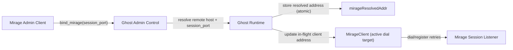
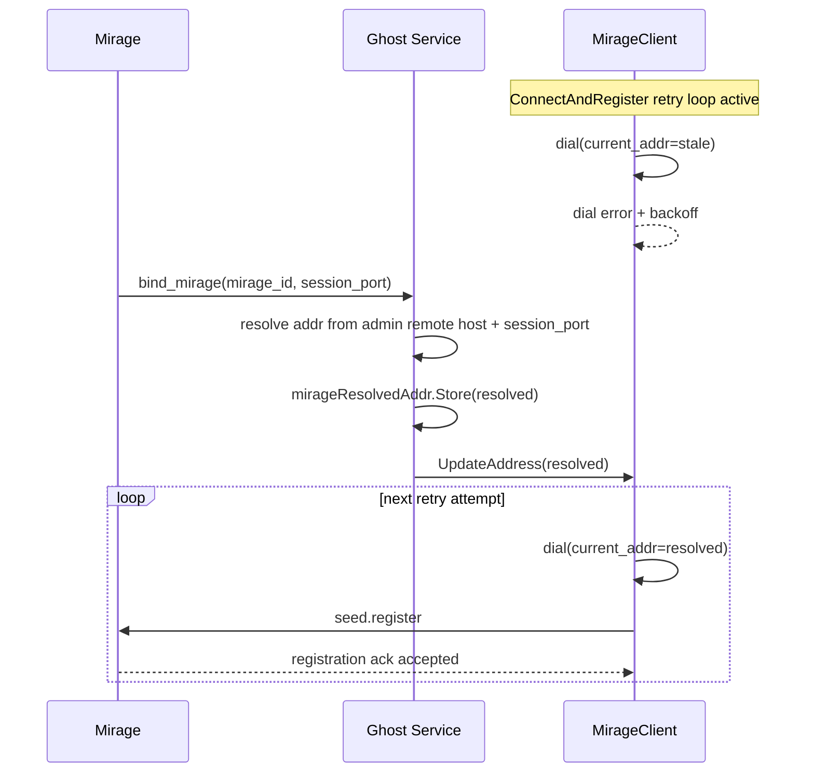

# Mirage Address Reroute Tracker

**Status:** `Completed`
**Scope:** `ghost_mirage_dynamic_address_reroute`

## Contract References

- `docs/architecture/definitions/protocol.toml`
- `docs/architecture/definitions/handshake.toml`
- `docs/architecture/definitions/reliability.toml`
- `docs/architecture/definitions/observability.toml`

## Goal

Ghost must be able to switch an in-flight Mirage connect/register loop to a newly resolved session address after Mirage and Ghost make admin-path contact (`bind_mirage`), without waiting for a full loop restart.

## Architecture Diagram

## Message Flow Diagram

## Failure Modes and Reliability Expectations

- Invalid `bind_mirage` address components:
  - Ghost keeps prior dial address and logs route-bind state without resolved session address.
- No in-flight connect client when `bind_mirage` arrives:
  - Ghost stores `mirageResolvedAddr`; next connect attempt uses resolved address.
- Concurrent `bind_mirage` updates:
  - Last write wins for active dial target and resolved address.
- Resolved address becomes unreachable:
  - Existing retry/backoff policy remains authoritative (`reliability.toml`), with warning logs per failed attempt.
- Handshake or registration rejection:
  - Existing handshake/registration semantics remain unchanged (`handshake.toml`).

## Idempotency and Timeout/Retry Expectations

- `bind_mirage` is idempotent for the same resolved address and safe for repeated delivery.
- Address updates are side-effect free beyond dial-target mutation.
- Connect timeout, handshake timeout, and exponential backoff parameters are unchanged.

## Implementation Checklist

- [x] Add concurrency-safe mutable dial target to `MirageClient`.
- [x] Make `ConnectAndRegister` dial/log paths read current address per attempt.
- [x] Track active in-flight Mirage client in `Service`.
- [x] Push resolved `bind_mirage` address into active client immediately.
- [x] Keep reconnect/backoff policy unchanged.
- [x] Add targeted tests for client-level and service-level reroute behavior.
- [x] Run full repository conformance tests.
