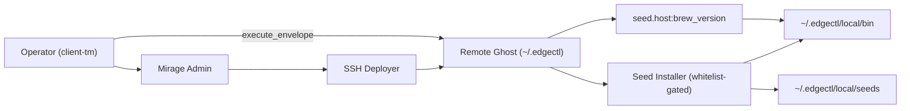
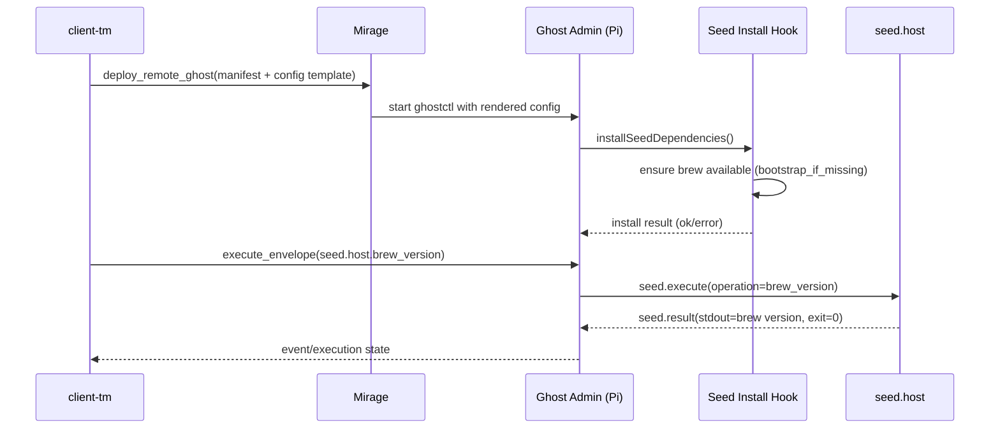

# Pi Homebrew Bootstrap + Ghost-Local Dependency Control

Status: `Done`

## Scope

- Validate Ghost seed-install bootstrap path for Homebrew on remote Pi targets.
- Ensure Ghost-managed runtime artifacts remain under `~/.edgectl/local` with executable surface in `~/.edgectl/local/bin`.
- Keep deploy flow template-first (`pi.tls.config.toml` style), then apply target-specific overrides.

## Completed Changes

- [x] Added declarative remote dependency policy fields to Mirage ghost manifests:
  - `seed_install_enabled`
  - `seed_install_root`
  - `seed_install_bin_root`
  - `seed_install_allow_internal_defaults`
  - `seed_install_whitelist`
  - `seed_install` install specs
  - `config_template_path`
- [x] Extended SSH deploy config generation to:
  - load from template TOML first
  - override runtime identity/network fields (`id`, `admin_listen`, `mirage_policy`, `mirage_address`, `mirage_peer_identity`)
  - inject seed-install policy
  - default internal whitelist when enabled and explicit whitelist is empty
- [x] Extended client-tm remote deploy prompts for:
  - admin listen address
  - config template path
- [x] Added `seed.host` operation/template for Homebrew version verification:
  - `brew_version`
  - `seed.host.brew_version`
- [x] Updated ghostctl workspace-root fallback so remote configs resolve `local/...` from config directory when no `go.mod` is present.
- [x] Switched seed installer default runner to PATH-prepending runner with configured `binRoot` preference.
- [x] Updated remote ghost launch command to prepend `~/.edgectl/local/bin` in process PATH.

## Architecture Diagram

## Message Flow Diagram

## Failure Modes / Idempotency Notes

- Bootstrap failure remains fail-fast during ghost startup, preserving explicit operator visibility.
- PATH mismatches are reduced by prepending `~/.edgectl/local/bin` for ghost runtime and seed-installer execution.
- Install-root confinement remains enforced by existing installer sandbox checks under `local/`.
- `brew_version` is idempotent and safe to repeat for verification.

## Validation

- [x] `go test ./...` passes after implementation.
