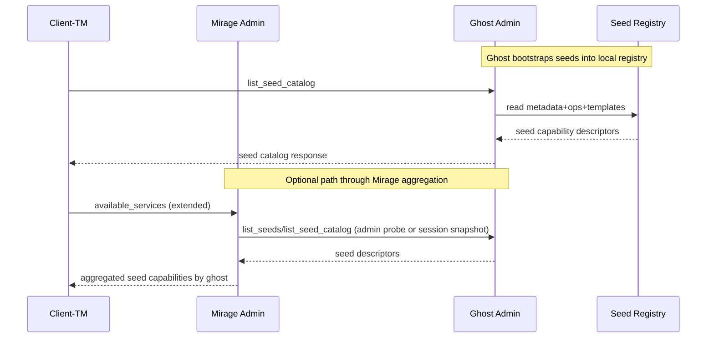
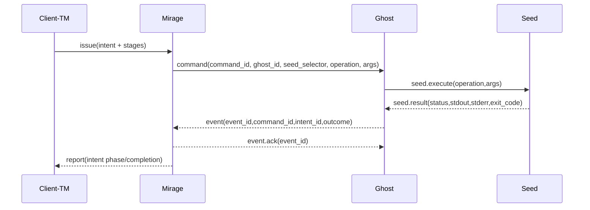

# Seed Coupling Tracker

**Status:** `In Progress`  
**Scope:** `seed_coupling`  
**Related phases:** `mvp_p6`, `pbreak_client_terminal`

## Goal

- Move Ghost command template catalog ownership from `cmd/client-tm` to seed interfaces.
- Keep client-side `CommandTemplate` shape stable so UI/intent flows do not churn.
- Reduce duplicated abstractions by removing static client catalog logic.
- Prepare discovery contracts for async operations and multi-ghost scheduling.

## Problem Statement (Current Coupling)

- Ghost command templates are hardcoded in `/Users/danmuck/local/edgectl/cmd/client-tm/cmd_ghost.go`.
- Runtime operation filtering is inferred locally in `/Users/danmuck/local/edgectl/cmd/client-tm/util.go` via `operationsForSeed(...)`.
- Mirage discovery currently exposes only `seed_id -> ghost_ids` availability; it does not expose command template contracts.
- Result: capability ownership is split between seeds (operations) and client (templates/args/defaults), causing drift risk and extra code.

## Target Ownership Model

- Seed owns:
  - identity metadata (`id`, `name`, `description`)
  - supported operations
  - command template descriptors (args/prompts/defaults/blocking semantics)
- Ghost owns:
  - seed registry + execution
  - capability publication through admin/session boundaries
- Mirage owns:
  - cross-ghost aggregation/routing of capabilities
  - intent orchestration over discovered capabilities
- Client owns:
  - rendering and operator interaction only
  - mapping remote template descriptors into existing local `CommandTemplate` shape

## Architecture Artifact

```mermaid
flowchart LR
    Seed["Seed Implementation (seed.*)"] -->|"Metadata + Operations + Templates"| GhostReg["Ghost Seed Registry"]
    GhostReg -->|"list_seed_catalog (admin)"| GhostAdmin["Ghost Admin API"]
    GhostReg -->|"seed.register payload"| MirageSess["Mirage Session Ingest"]
    MirageSess --> MirageCatalog["Mirage Capability Catalog"]
    MirageCatalog -->|"available_services + templates"| MirageAdmin["Mirage Admin API"]
    GhostAdmin --> ClientGhost["Client-TM Ghost Console"]
    MirageAdmin --> ClientMirage["Client-TM Mirage Console"]
    ClientGhost -->|"execute_envelope"| GhostExec["Ghost Command Pipeline"]
    ClientMirage -->|"issue/reconcile"| GhostExec
```

## Message Flow Artifact (Capability Discovery)

## Message Flow Artifact (Execution; Unchanged Core)

## Contract Changes (Planned)

- `internal/seeds`:
  - add seed-scoped template descriptor types that map 1:1 to current client `CommandTemplate`/`CommandArgSpec` fields.
  - extend seed interface to publish template descriptors from each seed implementation.
- `internal/ghost`:
  - expose a catalog read surface returning metadata + operations + templates.
  - keep existing `list_seeds` compatibility path during transition.
- `internal/mirage`:
  - add capability aggregation path that can surface seed templates to Mirage clients.
  - preserve current `available_services` shape while introducing extended catalog output.
- `cmd/client-tm`:
  - remove `ghostCommandTemplateCatalog()` static definitions.
  - remove local operation inference for template eligibility.
  - map remote seed template descriptors into existing `CommandTemplate` UI flow.

## Invariants

- `execute_envelope` remains the only Ghost execute boundary for admin control.
- Envelope IDs and canonical protocol field IDs are unchanged.
- Client `CommandTemplate` shape remains stable.
- Capability reads are side-effect free and idempotent.
- Capability payloads must use stable ordering for deterministic UI/tests.

## Failure Modes, Timeouts, Retries, Idempotency

- Ghost capability read timeout:
  - client falls back to cached last-good catalog for that target (read-only warning in UI).
- Mirage aggregation partial failure:
  - return per-ghost capability status and exclude timed-out ghosts from aggregated template set.
- Duplicate catalog payloads:
  - treat as idempotent snapshots keyed by `(ghost_id, seed_id, catalog_version)` once versioning lands.
- Seed template drift during runtime:
  - treat catalog as eventually consistent; execution still authoritative at Ghost boundary.

## Implementation Stages

- [ ] **Stage 1: Seed Contract Extension**
  - [ ] Define seed-level template descriptor types in `internal/seeds`.
  - [ ] Extend seed interface to return template descriptors.
  - [ ] Implement template descriptors for built-in seeds (`flow`, `mongod`, `fs`, `kv`, `docker`, `host`).
- [ ] **Stage 2: Ghost Capability Publication**
  - [ ] Add Ghost service/admin catalog read method exposing metadata+operations+templates.
  - [ ] Add admin action for full catalog; preserve existing `list_seeds` action temporarily.
  - [ ] Add unit tests for deterministic ordering and payload completeness.
- [ ] **Stage 3: Mirage Capability Aggregation**
  - [ ] Add Mirage-side catalog snapshot structure aligned to Ghost output.
  - [ ] Add/extend admin action to return aggregated seed template capabilities.
  - [ ] Add tests for mixed connectivity and partial ghost availability.
- [ ] **Stage 4: Client Migration + Code Reduction**
  - [ ] Remove static ghost template catalog in `cmd/client-tm/cmd_ghost.go`.
  - [ ] Remove local `operationsForSeed` abstraction for Ghost command wizard filtering.
  - [ ] Keep existing `CommandTemplate` rendering/prompt pipeline; only change the source of data.
  - [ ] Update tests to assert remote capability-driven behavior.
- [ ] **Stage 5: Async + Multi-Ghost Readiness Hooks**
  - [ ] Ensure template descriptor supports blocking/default execution hints already used by client.
  - [ ] Add optional non-breaking fields for future async dispatch hints and multi-ghost scheduling affinity.
  - [ ] Validate no regression to current orchestration semantics.

## Acceptance Checks

- [ ] Client Ghost command wizard renders from seed-provided templates only.
- [ ] No static command template catalog remains in `cmd/client-tm`.
- [ ] Built-in seeds publish complete template descriptors with deterministic ordering.
- [ ] Mirage can return aggregated capability data sufficient for intent-template filtering.
- [ ] Existing `issue -> command -> seed.execute -> seed.result -> event -> report` flow remains unchanged.
- [ ] `go test ./...` passes.

## Code Reduction Targets

- [ ] Remove static template catalog maintenance in `cmd/client-tm/cmd_ghost.go`.
- [ ] Remove local seed operation inference switch in `cmd/client-tm/util.go`.
- [ ] Eliminate duplicated operation/template filtering logic in client path.

